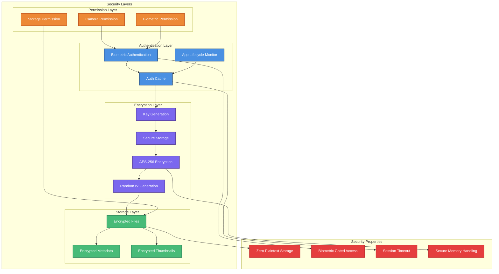
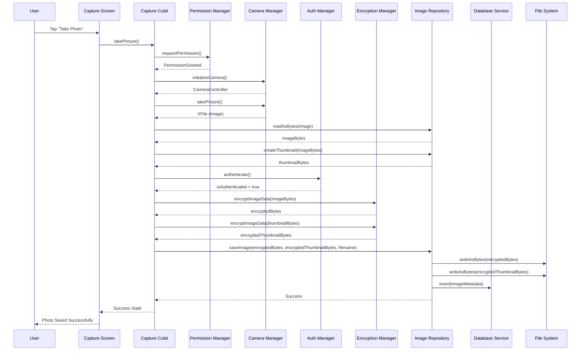

# SecureCapture - Architectural Approach Analysis

## Overview
SecureCapture is a Flutter application that implements a **secure image capture and storage system** using modern architectural patterns and security best practices. The app follows **Clean Architecture** principles with a focus on security, scalability, and maintainability.

## Architecture Overview Diagram

```mermaid
graph TB
    %% UI Layer
    subgraph "Presentation Layer"
        DS[Dashboard Screen]
        CS[Capture Screen]
        GS[Gallery Screen]
        
        subgraph "BLoC/Cubit"
            CC[Capture Cubit]
            GC[Gallery Cubit]
        end
        
        subgraph "States"
            CST[Capture State]
            GST[Gallery State]
        end
    end
    
    %% Domain Layer
    subgraph "Domain Layer"
        subgraph "Managers"
            AM[Authentication Manager]
            EM[Encryption Manager]
            PM[Permission Manager]
            CM[Camera Manager]
        end
        
        subgraph "Repositories"
            IR[Image Repository]
        end
        
        subgraph "Store"
            ALS[App Lifecycle Store]
        end
    end
    
    %% Data Layer
    subgraph "Data Layer"
        subgraph "Services"
            DS_DB[Database Service]
            IPS[Image Processing Service]
        end
        
        subgraph "Models"
            IM[Image Model]
        end
    end
    
    %% External Layer
    subgraph "External Dependencies"
        subgraph "Storage"
            SQLite[(SQLite Database)]
            FSS[Flutter Secure Storage]
            FS[File System]
        end
        
        subgraph "Platform APIs"
            CAM[Camera API]
            LA[Local Auth API]
            PH[Permission Handler]
        end
    end
    
    %% Dependency Injection
    subgraph "Dependency Injection"
        GetIt[GetIt Container]
        Injectable[Injectable Annotations]
    end
    
    %% Connections - UI to BLoC
    DS --> CC
    CS --> CC
    GS --> GC
    
    CC --> CST
    GC --> GST
    
    %% Connections - BLoC to Domain
    CC --> AM
    CC --> EM
    CC --> PM
    CC --> CM
    CC --> IR
    
    GC --> AM
    GC --> EM
    GC --> IR
    
    %% Connections - Domain to Data
    AM --> ALS
    EM --> FSS
    PM --> PH
    CM --> CAM
    IR --> DS_DB
    IR --> IPS
    IR --> FS
    
    %% Connections - Data to External
    DS_DB --> SQLite
    IR --> IM
    
    %% Dependency Injection connections
    GetIt -.-> AM
    GetIt -.-> EM
    GetIt -.-> PM
    GetIt -.-> CM
    GetIt -.-> IR
    GetIt -.-> DS_DB
    GetIt -.-> IPS
    
    Injectable -.-> GetIt
    
    %% Styling
    classDef uiLayer fill:#4a90e2,stroke:#2c5282,stroke-width:2px,color:#fff
    classDef domainLayer fill:#7b68ee,stroke:#553c9a,stroke-width:2px,color:#fff
    classDef dataLayer fill:#48bb78,stroke:#2f855a,stroke-width:2px,color:#fff
    classDef externalLayer fill:#ed8936,stroke:#c05621,stroke-width:2px,color:#fff
    classDef diLayer fill:#38b2ac,stroke:#2c7a7b,stroke-width:2px,color:#fff
    
    class DS,CS,GS,CC,GC,CST,GST uiLayer
    class AM,EM,PM,CM,IR,ALS domainLayer
    class DS_DB,IPS,IM dataLayer
    class SQLite,FSS,FS,CAM,LA,PH externalLayer
    class GetIt,Injectable diLayer
```



> 🔗 **[View Full Architecture Diagram](Architecture.png)** - Click to see the complete architecture overview in high resolution

## Core Architectural Patterns

### 1. Clean Architecture Implementation
The codebase is structured using Clean Architecture with clear separation of concerns:

lib/
├── core/
│ ├── shared_data/ # Data Layer
│ ├── shared_domain/ # Domain Layer
│ └── widgets/ # Reusable UI Components
├── features/ # Presentation Layer
│ ├── capture/ # Camera capture feature
│ ├── gallery/ # Image gallery feature
│ └── dashboard/ # Main dashboard
└── di/ # Dependency Injection

**Benefits:**
- **Testability**: Each layer can be tested independently
- **Maintainability**: Clear boundaries between business logic and UI
- **Scalability**: Easy to add new features without affecting existing code

### 2. Dependency Injection with Injectable/GetIt
Uses `injectable` with code generation for comprehensive dependency management:

```dart
@LazySingleton(as: EncryptionManager)
class EncryptionManagerImpl implements EncryptionManager
```

**Approach:**
- Interface-based design for easy testing and mocking
- Lazy singletons for performance optimization
- Environment-based configuration support

### 3. State Management - BLoC Pattern
Implements **BLoC (Business Logic Component)** pattern with `flutter_bloc`:

```dart
class GalleryCubit extends Cubit<GalleryState> {
  // Reactive state management with streams
  StreamSubscription<bool>? _isAuthenticatedSubscription;
}
```

**Key Features:**
- **Reactive Programming**: Uses RxDart for stream management
- **Immutable States**: Freezed classes for type-safe state management

### 4. Multi-Layered Security Architecture

#### Security Architecture Diagram



> 🔗 **[View Full Security Architecture Diagram](Security%20Architecture.png)** - Click to see the complete security architecture in high resolution

#### a) Biometric Authentication
```dart
@LazySingleton(as: AuthenticationManager)
class AuthenticationManagerImpl {
  // Integrates with device biometrics (Face ID, Touch ID, Fingerprint)
  Future<bool> authenticate() async {
    return await _localAuthentication.authenticate(
      localizedReason: 'Authenticate to access your private key'
    );
  }
}
```

#### b) AES Encryption for Images
```dart
Future<List<int>> encryptImageData(List<int> imageBytes) async {
  final encrypter = Encrypter(AES(encryptionKey));
  final iv = IV.fromSecureRandom(16); // Random IV for each encryption
  return encrypter.encryptBytes(imageBytes, iv: iv);
}
```

#### c) Secure Key Storage
- Uses `FlutterSecureStorage` for encryption keys
- Keys are protected by biometric authentication
- Automatic key generation with 256-bit AES

#### d) App Lifecycle Security
```dart
class AppLifeCycleStore {
  // Automatically revokes authentication when app goes to background
  void _changeState(AppLifecycleState state) {
    if (state.isHidden) {
      authenticationManager.revokeAuthentication();
    }
  }
}
```

### 5. Data Persistence Strategy

#### a) SQLite Database
```dart
CREATE TABLE encrypted_images (
  id TEXT PRIMARY KEY,
  filename TEXT NOT NULL,
  file_path TEXT NOT NULL,
  thumbnail_path TEXT NOT NULL
)
```

#### b) Encrypted File Storage
- Images stored as encrypted files in app documents directory
- Separate thumbnail storage for performance
- UUID-based naming for security

#### Data Flow Diagram - Image Capture & Encryption Process



> 🔗 **[View Full Data Flow Diagram](Data%20Flow%20Image%20Capture%20And%20Encryption.png)** - Click to see the complete data flow process in high resolution

### 6. Performance Optimizations

#### a) Intelligent Caching
```dart
// LRU-like (not exactly LRU) cache management for thumbnails
final Map<String, Uint8List> _thumbnailCache = {};
void _manageCacheSize() {
  if (_thumbnailCache.length >= _maxCacheSize) {
    // Remove oldest entries
    final keysToRemove = _thumbnailCache.keys.take(20).toList();
  }
}
```

#### b) Lazy Loading
- Images and thumbnails loaded on demand
- Asynchronous processing for smooth UI

### 7. Error Handling Strategy

#### a) Structured Error Hierarchy
```dart
abstract class DomainError {
  String get message;
}

class CommonError extends DomainError {
  final String message;
  CommonError(this.message);
}
```

#### b) Error Boundary Implementation
- Global error handling with `runZonedGuarded`
- Type-safe error propagation through BLoC states
- User-friendly error messages

### 8. Testing Architecture

#### a) Mock Generation
```dart
@GenerateMocks([
  AuthenticationManager,
  EncryptionManager,
  ImageRepository,
  DatabaseService,
])
```

#### b) BLoC Testing / Unit Testing
- Uses `bloc_test` for comprehensive state testing
- Mockito for dependency mocking
- Test-driven development approach
- `fake_async` for time-based operations and streams
- `test/features/capture/capture_cubit_test.dart` for example


#### c) Integration Testing
- Uses `integration_test` for end-to-end testing
- Uses `flutter_test` for unit testing
- Uses `mockito` for dependency mocking
- `integration_test/features/dashboard/dashboard_screen_test.dart` for example

#### d) Widget Testing
- Uses `flutter_test` for widget testing
- `test/core/widgets/button_test.dart` for example

## CI/CD Pipeline Architecture

### GitHub Actions Integration
The SecureCapture project implements a **continuous integration and deployment pipeline** using GitHub Actions to ensure code quality and reliability throughout the development lifecycle.

#### Pipeline Configuration
```yaml
# .github/workflows/dart.yml
name: Unit Tests
on:
  push:
    branches: [ main ]
  pull_request:
    branches: [ main ]
```

#### Automated Quality Assurance
The CI/CD pipeline enforces multiple quality gates:

1. **Environment Setup**: Configures Flutter 3.32.5 stable channel
2. **Dependency Resolution**: Installs project dependencies (`flutter pub get`)
3. **Code Generation**: Generates required code files (`flutter packages pub run build_runner build`)
4. **Static Analysis**: Runs comprehensive code analysis (`flutter analyze`)
5. **Unit Testing**: Executes complete test suite (`flutter test`)

#### Integration with Architecture
The CI/CD pipeline complements the clean architecture by:
- **Testing Layer Isolation**: Unit tests validate each architectural layer independently
- **Dependency Validation**: Ensures all injectable dependencies resolve correctly
- **Code Generation Validation**: Verifies generated code compiles and passes analysis
- **Security Testing**: Validates security implementations through unit tests

This automated pipeline ensures that the sophisticated security and architectural patterns implemented in the project remain stable and functional throughout development.

## Key Design Decisions

### 1. Security-First Approach
- **End-to-end encryption**: Images never stored in plain text
- **Biometric gating**: All sensitive operations require authentication
- **Memory safety**: Automatic cleanup of sensitive data

### 2. Reactive Architecture
- **Stream-based**: Real-time updates for authentication state
- **Event-driven**: Clear separation of user actions and business logic
- **Immutable states**: Prevents accidental state mutations

### 3. Modular Design
- **Feature-based organization**: Each feature is self-contained
- **Interface segregation**: Small, focused interfaces
- **Dependency inversion**: High-level modules don't depend on low-level modules

### 4. Performance Considerations
- **Lazy initialization**: Resources created only when needed
- **Caching strategies**: Smart thumbnail caching with size limits
- **Memory management**: Proper disposal of resources

## Architectural Diagrams Summary

The three diagrams above illustrate different aspects of the SecureCapture architecture:

### 1. Architecture Overview Diagram
- **Purpose**: Shows the complete system architecture with all layers and components
- **Key Insights**: 
  - Clear separation of concerns between UI, Domain, and Data layers
  - Dependency injection pattern connecting all components
  - External dependencies isolation for better testability

### 2. Security Architecture Diagram
- **Purpose**: Highlights the multi-layered security approach
- **Key Insights**:
  - Four distinct security layers: Authentication, Encryption, Storage, and Permission
  - Security properties enforced at each layer
  - Biometric authentication as the gateway to all secure operations

### 3. Data Flow Diagram
- **Purpose**: Shows the complete image capture and encryption process
- **Key Insights**:
  - Step-by-step flow from user action to secure storage
  - Multiple security checkpoints throughout the process
  - Clear separation of responsibilities between components


## Conclusion

The SecureCapture application demonstrates a **mature, production-ready architecture** that prioritizes:

1. **Security**: Multi-layered encryption and authentication
2. **Maintainability**: Clean Architecture with clear boundaries
3. **Testability**: Comprehensive mocking and testing strategies
4. **Performance**: Intelligent caching and lazy loading
5. **User Experience**: Smooth, responsive UI with proper error handling

This architecture provides a solid foundation for a secure image management application that can scale and evolve with changing requirements while maintaining high security standards.
